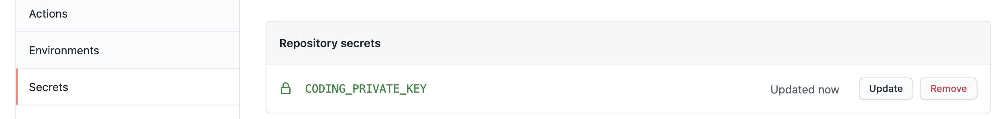

# Sync Repo to CODING

Forked this repo to backup.

本仓库是基于 [x-dr/sync-repo-to-gitee](https://github.com/x-dr/sync-repo-to-gitee) 进行的修改。

用于将 [GitHub](https://github.com/) 代码仓库同步到 [CODING](https://coding.net/) 代码仓库。

## SSH 密钥配置

创建一个 [SSH key](https://help.github.com/en/github/authenticating-to-github/generating-a-new-ssh-key-and-adding-it-to-the-ssh-agent#generating-a-new-ssh-key) ，
将公钥`id_rsa.pub`保存到 [Github SSH keys](https://github.com/settings/keys)和
「CODING 个人账户——> SSH公钥」，
将私钥 `id_rsa` 在 GitHub 项目的 Settings -> Secrets 路径下配置好 CODING_PRIVATE_KEY



## workflow example

```
name: Sync Repo to CODING
on:
  push:
  schedule:
    # 每天北京时间0点同步
    - cron:  '0 16 * * *'

jobs:
  build:
    runs-on: ubuntu-latest
    steps:
    - name: Sync Repo to CODING
      uses: serverlesslife-cn/sync-repo-to-coding@master
      env:
          # 在 GitHub Settings->Secrets 配置 CODING_PRIVATE_KEY
          SSH_PRIVATE_KEY: ${{ secrets.CODING_PRIVATE_KEY }}
      with:
          # 注意替换为你的 GitHub 源仓库地址
          github-repo: "git@github.com:serverlesslife-cn/sync-repo-to-coding.git"
          # 注意替换为你的 CODING 目标仓库地址
          coding-repo: "git@e.coding.net:donghui1/serverlesslife/sync-repo-to-coding.git"
```


